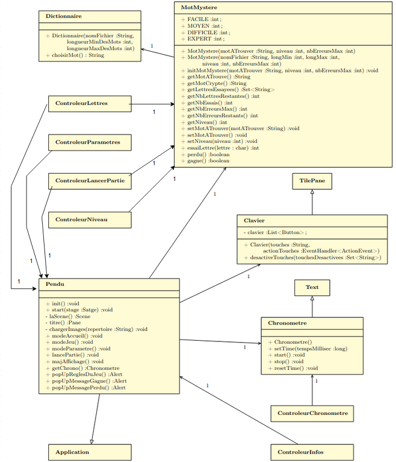

# Exercice 1 
## 1) Identifier le MCV 
### Vue: 
- Pendu 
- Clavier
- Chronometre
### Controleur: 
- ControleurLancerPartie
- ControleurLettres
- ControleurNiveau
- ControleurChronometre
- ControleurInfos
- ControleurParametre
### Modèle: 
- Dictionnaire 
- MotMystere

## 2) Diagramme de classe
